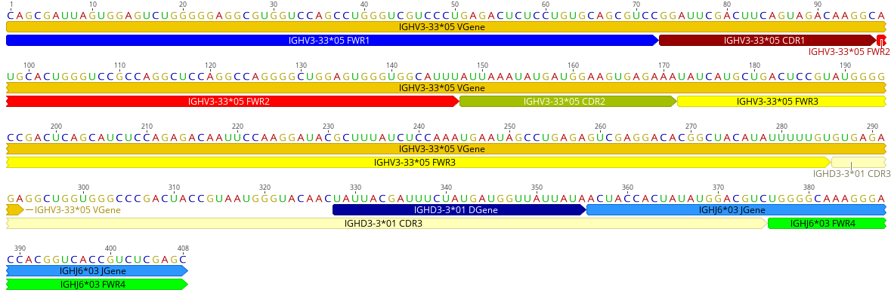

# Visualizing Sadie Annotation in GenBank Format

After generating Annotations using BLAST implemented in Sadie as AIrr or with HMMER, implemented as Renumbering, you can convert the annotations as features in a Genbank formatted file and then visualize them using your favorite gene browser like Genious. This tutorial shows how you can convert your annotations to GenBank. You can also test it out in a [Collab Notebook](https://colab.research.google.com/github/kipkurui/sadie/blob/genbank_notebook/notebooks/airr_c/GenBank_Annotation.ipynb).

## Renumberring HMM
The renumbering module in Sadie uses HMMER to annotate the antibody sequences.

```Python
{!docs_src/annotation/tutorial006.py!}
```

will print out

```


LOCUS       PG9                      136 aa                     UNK 01-JAN-1980
DEFINITION  .
ACCESSION   PG9
VERSION     PG9
KEYWORDS    .
SOURCE      .
  ORGANISM  human
            .
FEATURES             Location/Qualifiers
     FWR1            1..24
                     /reference="human"
                     /gene="IGHV3-30*02"
     CDR1            25..32
                     /reference="human"
                     /gene="IGHV3-30*02"
     FWR2            33..49
                     /reference="human"
                     /gene="IGHV3-30*02"
     CDR2            50..57
                     /reference="human"
                     /gene="IGHV3-30*02"
     FWR3            58..95
                     /reference="human"
                     /gene="IGHV3-30*02"
     CDR3            96..125
                     /reference="human"
                     /gene="Missing"
     FWR4            126..136
                     /reference="human"
                     /gene="IGHJ6*04"
ORIGIN
        1 qrlvesgggv vqpgsslrls caasgfdfsr qgmhwvrqap gqglewvafi kydgsekyha
       61 dsvwgrlsis rdnskdtlyl qmnslrvedt atyfcvreag gpdyrngyny ydfydgyyny
      121 hymdvwgkgt tvtvss
//

```
This format has minimal features and description but allows us to visualize the annotations of the amino acid sequence.

## Now we can write the record to file and visualize
```python
with open(f'{seg_name}_hmmer.gb',"w") as handle:
    SeqIO.write(genbank_record,handle,"genbank")
```

You can then load the GenBank file and export the visualization:


## BLAST Annotation Using SADIE
Sadie uses igblastn to annotate the sequence provided, which runs through the AIRR API. It can take a single sequence, fasta, or a directory with several files. The output is an AirrTable, which inherits from Pandas DataFrame and has the same functionalities, plus a few more. We parse the AirTable to get the features added to the Genbank annotation.


For AIRR annotation, we have two options. We can annotate the file  and convert directly to Genbank format
```Python
{!docs_src/annotation/tutorial006.py!}
```



Or fetch a Genbank file from NCBI, then add the features to the file using BioPython. This gives us an exhaustive annotation, which we can visualize as described above.


```Python
if __name__ == "__main__":
    email = 'example@mail.com'
    gene_id = 'GU272045.1'
    # Can use a provided sequence
    genbank_record = main(email=email, gene_id=gene_id)
    with open(f'{gene_id}_complete.gb',"w") as handle:
        SeqIO.write(genbank_record,handle,"genbank")
```
which generates

```
LOCUS       GU272045                 408 bp    mRNA    linear   PRI 24-JUL-2016
DEFINITION  Homo sapiens isolate PG9 anti-HIV immunoglobulin heavy chain
            variable region mRNA, partial cds.
ACCESSION   GU272045
VERSION     GU272045.1
KEYWORDS    .
SOURCE      Homo sapiens (human)
  ORGANISM  Homo sapiens
            Eukaryota; Metazoa; Chordata; Craniata; Vertebrata; Euteleostomi;
            Mammalia; Eutheria; Euarchontoglires; Primates; Haplorrhini;
            Catarrhini; Hominidae; Homo.
REFERENCE   1  (bases 1 to 408)
  AUTHORS   Walker,L.M., Phogat,S.K., Chan-Hui,P.Y., Wagner,D., Phung,P.,
            Goss,J.L., Wrin,T., Simek,M.D., Fling,S., Mitcham,J.L.,
            Lehrman,J.K., Priddy,F.H., Olsen,O.A., Frey,S.M., Hammond,P.W.,
            Kaminsky,S., Zamb,T., Moyle,M., Koff,W.C., Poignard,P. and
            Burton,D.R.
  CONSRTM   Protocol G Principal Investigators
  TITLE     Broad and potent neutralizing antibodies from an African donor
            reveal a new HIV-1 vaccine target
  JOURNAL   Science 326 (5950), 285-289 (2009)
   PUBMED   19729618
REFERENCE   2  (bases 1 to 408)
  AUTHORS   Chan-Hui,P.-Y.
  TITLE     Direct Submission
  JOURNAL   Submitted (04-DEC-2009) In Vitro Pharmacology, Theraclone-Sciences,
            1124 Columbia Street, Seattle, WA 98104, USA
FEATURES             Location/Qualifiers
     source          1..408
                     /organism="Homo sapiens"
                     /mol_type="mRNA"
                     /isolate="PG9"
                     /db_xref="taxon:9606"
     CDS             <1..>408
                     /note="anti-HIV antibody"
                     /codon_start=1
                     /product="anti-HIV immunoglobulin heavy chain variable
                     region"
                     /protein_id="ADA54566.1"
                     /translation="QRLVESGGGVVQPGSSLRLSCAASGFDFSRQGMHWVRQAPGQGLE
                     WVAFIKYDGSEKYHADSVWGRLSISRDNSKDTLYLQMNSLRVEDTATYFCVREAGGPDY
                     RNGYNYYDFYDGYYNYHYMDVWGKGTTVTVSS"
     FWR1            1..72
                     /gene="IGHV3-33*05"
                     /reference="human"
     CDR1            73..96
                     /gene="IGHV3-33*05"
                     /reference="human"
     FWR2            97..147
                     /gene="IGHV3-33*05"
                     /reference="human"
     CDR2            148..171
                     /gene="IGHV3-33*05"
                     /reference="human"
     FWR3            172..285
                     /gene="IGHV3-33*05"
                     /reference="human"
     CDR3            286..375
                     /gene="IGHD3-3*01"
                     /reference="human"
     FWR4            376..408
                     /gene="IGHJ6*03"
                     /reference="human"
     VGene           1..293
                     /gene="IGHV3-33*05"
                     /species="human"
     DGene           328..355
                     /gene="IGHD3-3*01"
                     /species="human"
     JGene           356..408
                     /gene="IGHJ6*03"
                     /species="human"
ORIGIN
        1 cagcgattag tggagtctgg gggaggcgtg gtccagcctg ggtcgtccct gagactctcc
       61 tgtgcagcgt ccggattcga cttcagtaga caaggcatgc actgggtccg ccaggctcca
      121 ggccaggggc tggagtgggt ggcatttatt aaatatgatg gaagtgagaa atatcatgct
      181 gactccgtat ggggccgact cagcatctcc agagacaatt ccaaggatac gctttatctc
      241 caaatgaata gcctgagagt cgaggacacg gctacatatt tttgtgtgag agaggctggt
      301 gggcccgact accgtaatgg gtacaactat tacgatttct atgatggtta ttataactac
      361 cactatatgg acgtctgggg caaagggacc acggtcaccg tctcgagc
//

```

and can be visualized as


